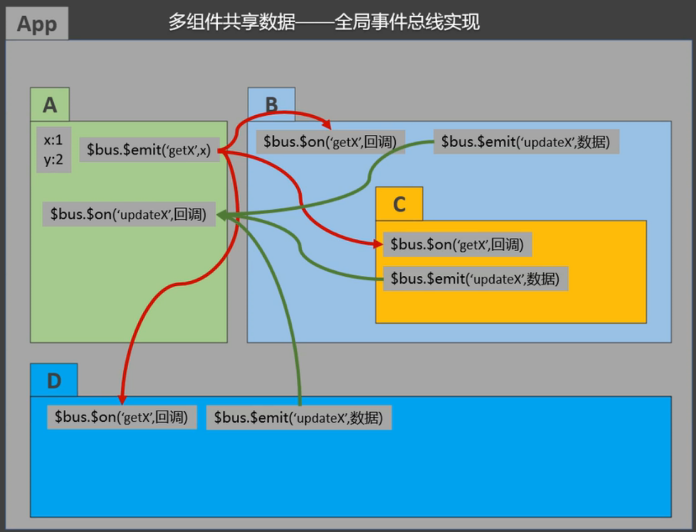
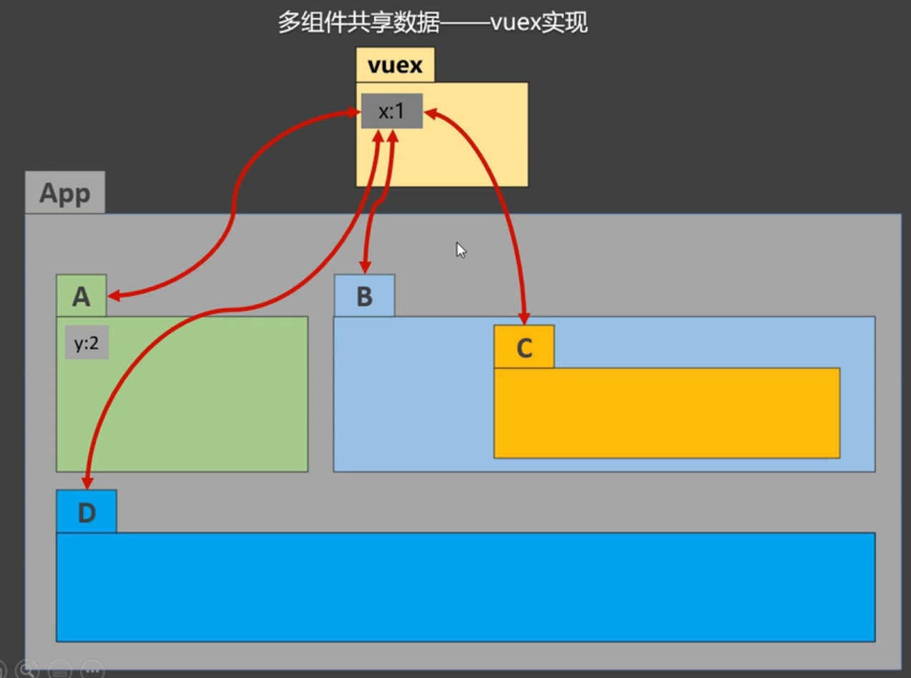
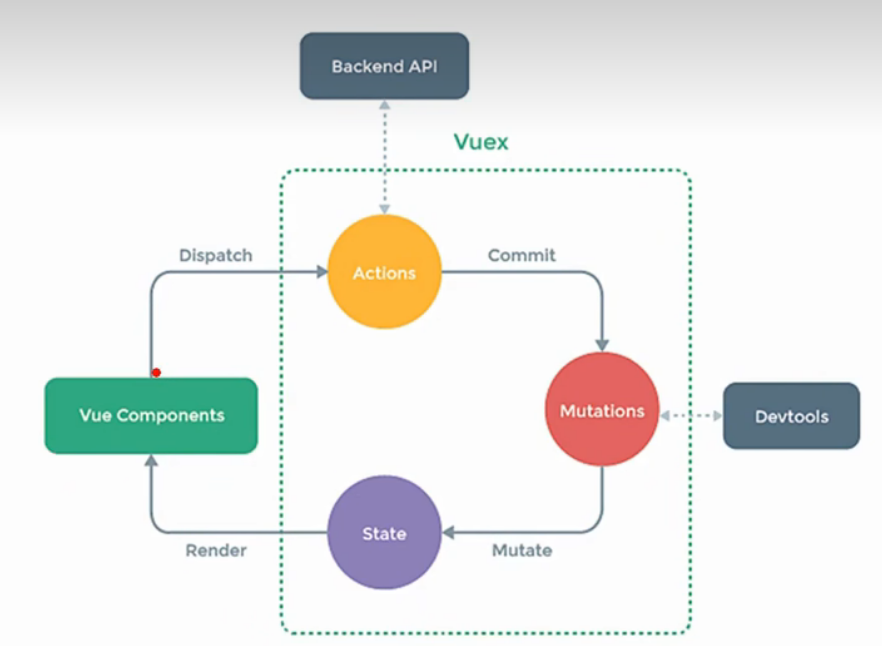
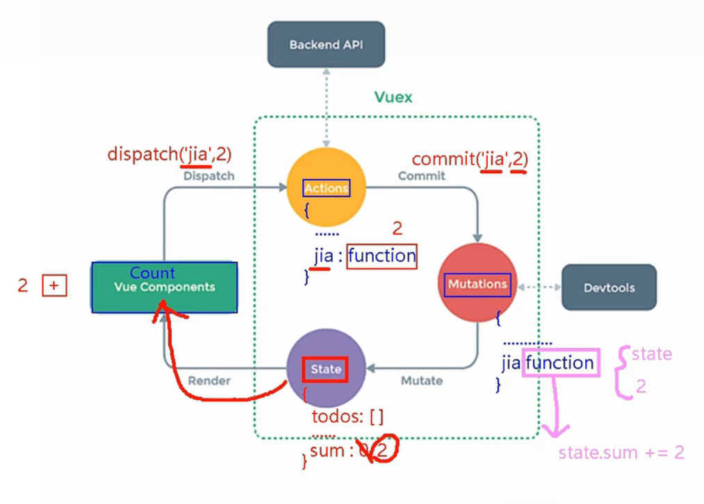
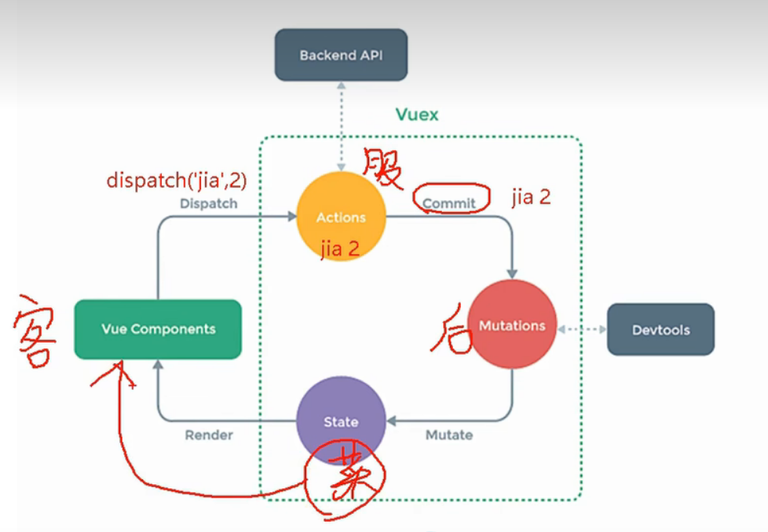

# vue_test

[toc]

## Project setup
```
npm install
```

### Compiles and hot-reloads for development
```
npm run serve
```

### Compiles and minifies for production
```
npm run build
```

### Lints and fixes files
```
npm run lint
```

### Customize configuration
See [Configuration Reference](https://cli.vuejs.org/config/).


## 发布与订阅

```
npm -i pubsub-js
```

在vue中尽量使用全局事件总线而不是发布与订阅


## 089-todolist案例-编辑

v-if v-show   变动比较频繁的使用v-show

//使用$event可以获取到事件对象  handleBlue(todo,e) {e.target.value //可以获取到input框的内容}

```
<input
      type="text"
      v-show="todo.isEdit"
      :value="todo.title"
      @blur="handleBlur(todo, $event)"
>
```

## 090 $nextTick

ref的作用。。。

//如果一个input框被隐藏了，再调用input框的focus不能获取焦点

```
 			handleEdit(todo){
                if(todo.hasOwnProperty('isEdit')) {
                    console.log("二次添加")
                    todo.isEdit = true
                } else {
                    // todo.isEdit = true //这种得到的不是响应式的，没有geter setter方法
                    this.$set(todo, 'isEdit', true)
                    console.log("初次添加")
                }
                // this.$refs.inputTitle.focus()//如果一个input框被隐藏了，再调用input框的focus不能获取焦点
                // setTimeout(()=>{
                //     this.$refs.inputTitle.focus()
                // },200)  可以使用定时器粗暴解决
                this.$nextTick(function(){
                    this.$refs.inputTitle.focus()
                })//nextTick所指定的回调函数会在dome节点更新完毕之后再执行
            },
```

作用：在下一次DOM更新结束后执行其指定的回调

什么时候用：当改变数据后，要基于更新后的新DOM进行某些操作时，要在nextTick所指定的回调函数中执行。

## 091动画效果

## 094集成第三方动画

https://www.npmjs.com/ 里搜animate.css

https://animate.style/

```
<transition-group
                appear
                name="animate__animated animate__bounce"
                enter-active-class="animate__swing"
                leave-active-class="animate__backOutUp"
        >
            <h1 v-show="!isShow" key="1">你好啊！</h1>
<!--            多元素过度使用 transition-group-->
            <h1 v-show="isShow" key="2">尚硅谷！</h1>
        </transition-group>
```

## 096 vue脚手架配置代理-方式一(ajax请求？,axios)

- xhr  (不常用)

```
xhr  new XMLHttpRequest()
xhr.open()
xhr.send()
```

- Jquery 等二次封装xhr   vue和react项目中很少使用Jquery发送请求。因为Jquery核心是封装DOM操作，使用Vue和react就是为了减少操作DOM。Jquery中有80%是封装DOM操作，剩下的20%左右才是封装其它如ajax请求等

```
$.get  $.post
```

- **axios**(用的最多，推荐用来发送请求。也二次封装xhr，promise风格，支持请求拦截器和响应拦截器，体积小大约只是Jquery的1/4)
- fetch(也是promise风格，它会将返回的数据包2层promise。兼容性较差，在IE浏览器上不能使用)
- vue-resource


下载并引入axios

```
npm i axios
```

### 解决跨域

- cors    后端人员配置
- jsonp  (script src，比较巧妙，开发中很少使用，但是面试常见) 平时很少用，而且只能解决get请求的跨域问题，post请求解决不了。
- **配置代理服务器**(开发中用的最多) `https://cli.vuejs.org/zh/config/#devserver-proxy`

```
1、nginx 
2、vue-cli
在文件vue.config.js中加入下述代码后，重新启动vue   npm run serve
//开启代理服务器(方式一，缺点：只能配置一个代理)
  devServer: {
    proxy: 'http://localhost:8090'
  }
```

开启代理后原来请求8090的地方要换成8080

> 在本地8080端口没有的内容才会到8090端口去拿

```
getStudents(){
                // axios.get('http://localhost:8090/student').then(
                axios.get('http://localhost:8080/student').then(
                    response => {
                        console.log('请求成功了',response.data)
                    },
                    error => {
                        console.log('请求失败了', error)
                    }
                )
            }
```


## 097_配置代理-方式二

在cmd窗口复制完东西之后，需要敲一下回车，否则会卡住。。。。。

```
const { defineConfig } = require('@vue/cli-service')
module.exports = defineConfig({
  transpileDependencies: true,
  //关闭eslint校验
  lintOnSave: false,
  //开启代理服务器(方式一)
  // devServer: {
  //   proxy: 'http://localhost:8090'
  // },
  //开启代理服务器(方式二)
  devServer: {
    proxy: {
      '/atguigu': {
        target: 'http://localhost:8090',
        pathRewrite:{'^/atguigu':''},
        // ws: true,//用于支持websocket  不写默认为true
        // changeOrigin: true  //不写默认为true
      },
      // '/foo': {
      //   target: '<other_url>'
      // }
    }
  }
})
```

## 098_静态组件

## 099_github案例_列表展示

https://api.github.com/search/users?q=xxxccc1986

## 101vue-resource库

## 102默认插槽

- 默认插槽
- 具名插槽
- 作用域插槽

## 105vuex(特别重要)

1. 概念：专门在Vue中实现集中式状态(数据)管理的一个Vue插件，对vue应用中多个组件的共享状态进行集中式的管理(读/写)，也是一种组件间通信的方式，且适用于任意组件间通信。

2. github地址：https://github.com/vuejs/vuex

   ### 什么时候使用Vuex

   1. 多个组件依赖于同一状态
   2. 来自不同组件的行为需要变更同一状态

   

多组件共享数据--vuex实现



## 106求和案例——纯vue实现

```
<template>
    <div>
        <h1>当前求和为{{sum}}</h1>
<!--        <select v-model="n">-->
<!--        收集到的类型强制转化为number类型-->
        <select v-model.number="n">
<!--            value不加冒号1，2,3为字符串，影响计算。加上冒号为数字-->
            <option value="1">1</option>
            <option :value="2">2</option>
            <option :value="3">3</option>
        </select>
        <button @click="increment">+</button>
        <button @click="decrement">-</button>
        <button @click="incrementOdd">当前求和为技术再加</button>
        <button @click="incrementWait">等一等再加</button>
    </div>
</template>

<script>
    export default {
        name:'Count',
        data(){
            return{
                n:1,//用户选择的数据
                sum:0//当前的和
            }
        },
        methods:{
            increment(){
                this.sum += this.n
            },
            decrement(){
                this.sum -= this.n
            },
            incrementOdd(){
                if(this.sum % 2) {
                    this.sum += this.n
                }
            },
            incrementWait(){
                setTimeout(()=>{
                    this.sum += this.n
                },500)
            },
        }
    }
</script>

<style>
    button{
        margin-left: 5px;
    }
</style>

```


## 107vuex工作原理图









## 108 搭建vuex环境

```
npm i vuex
Vue.use(Vuex)
store
vc===>store


vue2中，要用vuex的3版本  npm i vuex@3
vue3中，要用vuex的4版本
```


## 117路由简介

vue-router是vue的一个插件库，专门来实现SPA应用

```
npm i vue-router

vue2中需要  npm i vue-router@3
Vue.user()
```

### SPA

- 单页Web应用(single page web application, SPA)
- 整个应用只有一个完整页面
- 点击页面中的导航链接不会刷新页面，只会做页面的局部刷新
- 数据要通过ajax请求获取

## 118路由基本使用

## 121路由传参

## 125 router-link的replace属性

- 作用:控制路由跳转时操作浏览器历史记录的模式

- 浏览器的历史记录有两种写入方式：分别是push和replace，push是追加历史记录，replace是替换当前记录。路由跳转时候默认为push

- 如何开启replace模式：`<router-link replace ....>News</router-link>`

## 126编程式路由导航

this.$router只有一份，所有人只能看到

$this.$route每人一份，只能看到自己的


## 127缓存路由组件

- 作用：让不展示的了路由组件保持挂载，不被销毁
- 具体编码

```
<keep-alive include="News">
	<router-view></router-view>
</keep-alive>
```

## 128路由组件独有的生命周期钩子

- 路由组件所独有的两个钩子，用于捕获路由组件的激活状态

```
activated(){}   路由组件被激活时触发
deactived(){}   路由组件失活时触发
```

## 129全局前置-路由守卫(比较重要，开发中用的比较多)

路由守卫：保护路由的安全 ----权限相关

## 133history模式与hash模式

```
history   /
hash /#/   兼容性好
```

还涉及到项目上线的问题：

上线之前需要打包，生成最纯粹的.html .css .js 文件 使用命令：

```
npm run build
```


node express

- 新建demo文件夹
- 进入demo文件夹，运行npm init   输入package name后  一路回车
- npm i express

```
lrz@DESKTOP-LCVU4R0 MINGW64 ~/Desktop/demo
$ npm init
npm WARN config global `--global`, `--local` are deprecated. Use `--location=global` instead.
This utility will walk you through creating a package.json file.
It only covers the most common items, and tries to guess sensible defaults.

See `npm help init` for definitive documentation on these fields
and exactly what they do.

Use `npm install <pkg>` afterwards to install a package and
save it as a dependency in the package.json file.

Press ^C at any time to quit.
package name: (demo) atguigu_test_server //输入名称，然后一路回车
version: (1.0.0)


....


```

```
npm i express
```

编写一个express服务

```
const express = require('express')

const app = express()

app.use(express.static(__dirname+'/static'))

app.get('/person',(req,res)=>{
	res.send({
		name:'tom',
		age:18
	})
})

app.listen(5005, (err)=>{
	if(!err) console.log("服务器启动成功了")
})
```

启动服务
```
node server
```

### 解决history模式下404的问题

**一般上线部署时，大多使用history模式**

npmjs.com

connet-history-api-fallback

```
在demo服务器执行
npm i connect-history-api-fallback
```

解决404问题   或者使用nginx解决。

```
const express = require('express')
const history = require('connect-history-api-fallback')

const app = express()

app.use(history())
app.use(express.static(__dirname+'/static'))

app.get('/person',(req,res)=>{
	res.send({
		name:'tom',
		age:18
	})
})

app.listen(5005, (err)=>{ 
	if(!err) console.log("服务器启动成功了")
})
```


IE8及其以下浏览器，访问不了Vue写的项目


## 134 element-ui基本使用

### 移动端常用组件库

- Vant https://youzan.github.io/vant
- Cube UI https://didi.github.io/cube-ui
- Mint UI http://mint-ui.github.io

- nutui  https://nutui.jd.com/     京东团队

### PC端常用UI组件库

- Element UI https://element.eleme.io/#/zh-CN    饿了么团队
- IView UI https://iview.github.io/

不需要整理笔记，用的时候看文档即可


```
 ERROR  Error: Cannot find module 'babel-preset-es2015'
        Require stack:
```


`npm i babel-preset-es201`


```
lrz@DESKTOP-LCVU4R0 MINGW64 ~/Desktop/vue_test (main)
$ npm run serve
npm WARN config global `--global`, `--local` are deprecated. Use `--location=global` instead.

> vue_test@0.1.0 serve
> vue-cli-service serve

 ERROR  Error: Plugin/Preset files are not allowed to export objects, only functions. In C:\Users\lrz\Desktop\vue_test\node_modules\babel-preset-es2015\lib\index.js
Error: Plugin/Preset files are not allowed to export objects, only functions. In C:\Users\lrz\Desktop\vue_test\node_modules\babel-preset-es2015\lib\index.js
    at createDescriptor (C:\Users\lrz\Desktop\vue_test\node_modules\@babel\core\lib\config\config-descriptors.js:211:11)
    at createDescriptor.next (<anonymous>)
    at evaluateSync (C:\Users\lrz\Desktop\vue_test\node_modules\gensync\index.js:251:28)
    at C:\Users\lrz\Desktop\vue_test\node_modules\gensync\index.js:31:34
    at Array.map (<anonymous>)
    at Function.sync (C:\Users\lrz\Desktop\vue_test\node_modules\gensync\index.js:31:22)
    at Function.all (C:\Users\lrz\Desktop\vue_test\node_modules\gensync\index.js:210:24)
    at Generator.next (<anonymous>)
    at createDescriptors (C:\Users\lrz\Desktop\vue_test\node_modules\@babel\core\lib\config\config-descriptors.js:142:41)
    at createDescriptors.next (<anonymous>)
```


出现上述问题，需要将代码：

```
//babel.config.js
module.exports = {
  presets: [
    '@vue/cli-plugin-babel/preset',
    ["es2015", { "modules": false }],
  ],
  plugins: [
    [
      "component",
      {
        "libraryName": "element-ui",
        "styleLibraryName": "theme-chalk"
      }
    ]
  ]
}
```

改为：

```
module.exports = {
  presets: [
    '@vue/cli-plugin-babel/preset',
    ["@babel/preset-env", { "modules": false }],
  ],
  plugins: [
    [
      "component",
      {
        "libraryName": "element-ui",
        "styleLibraryName": "theme-chalk"
      }
    ]
  ]
}

```


​    


